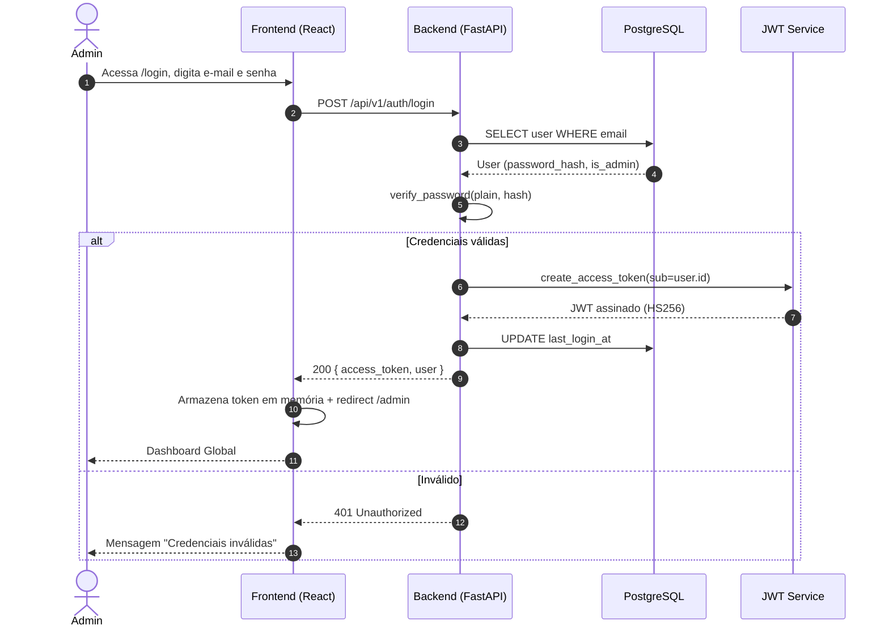
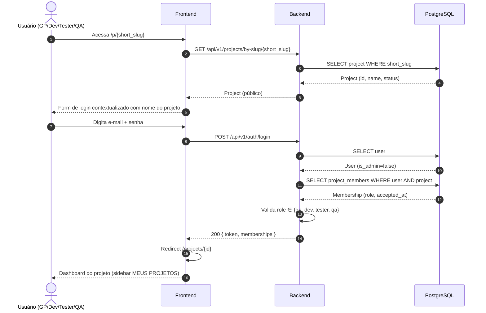
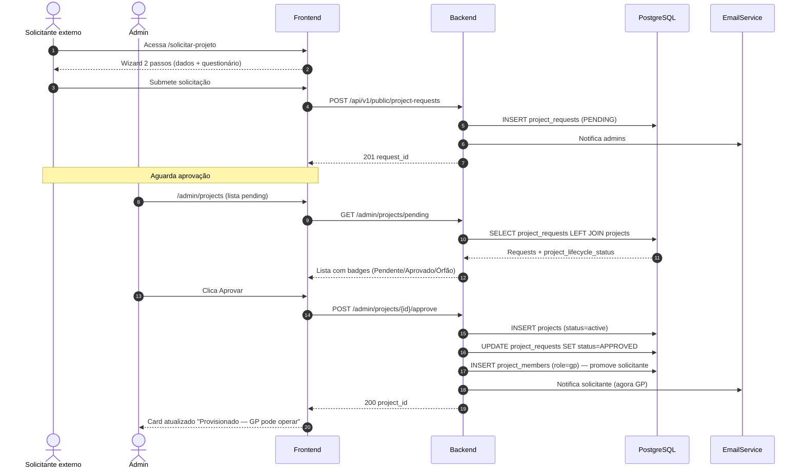
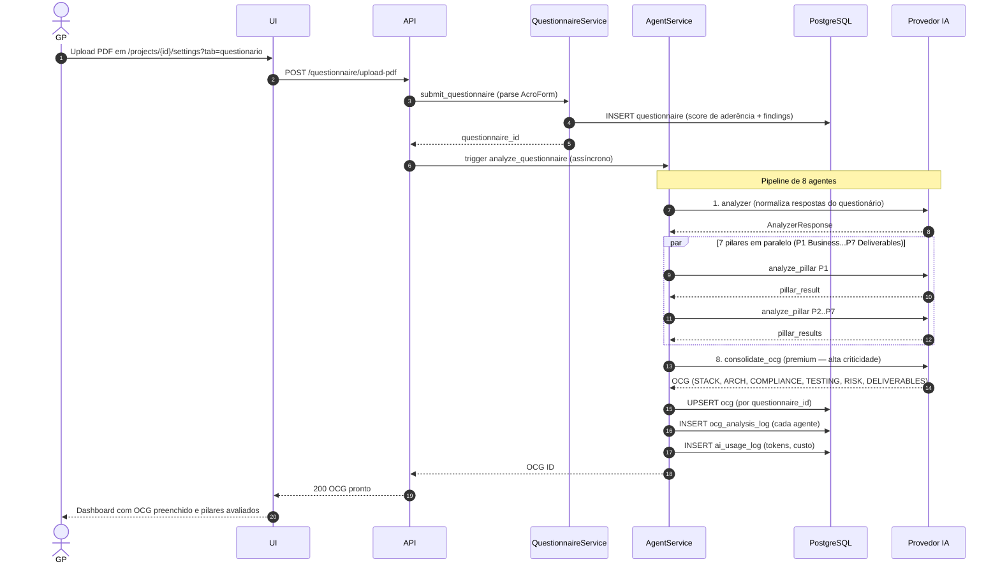
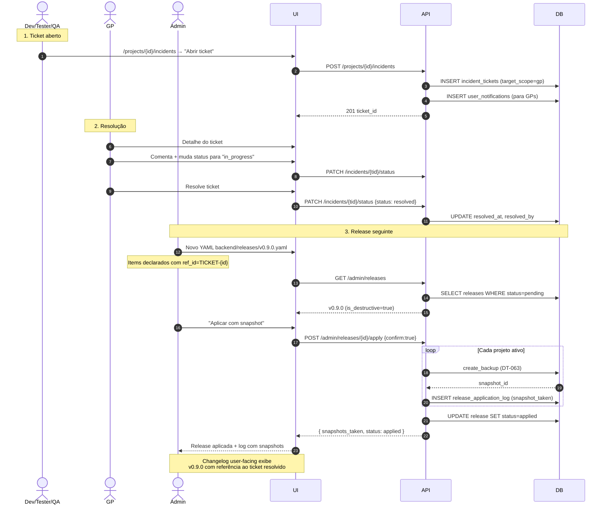
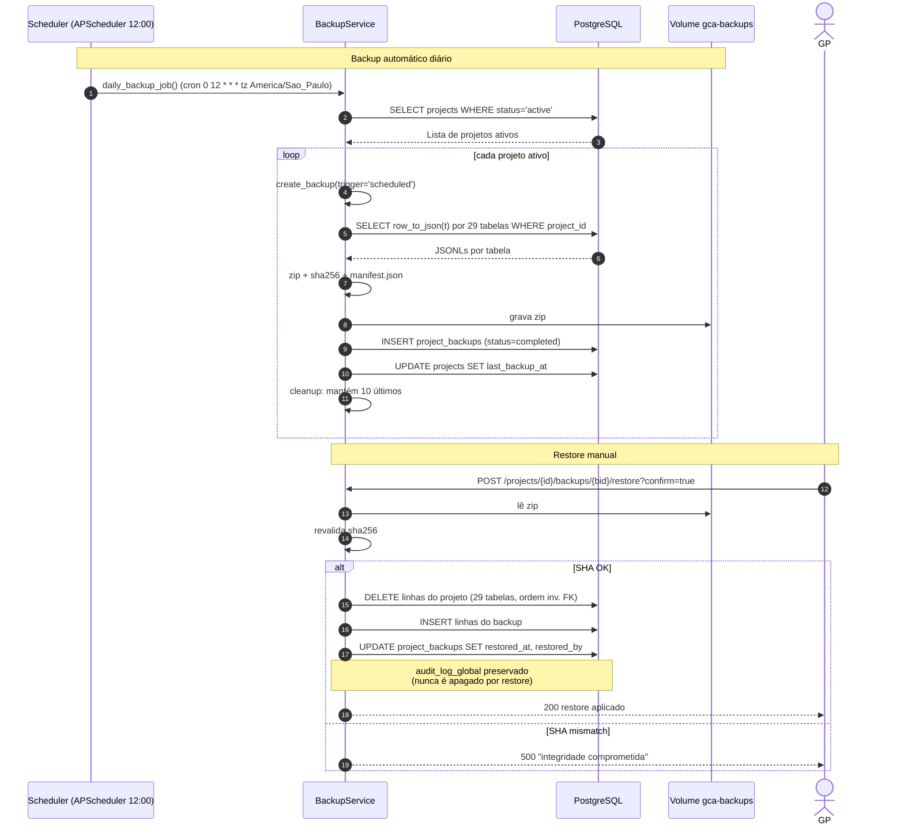
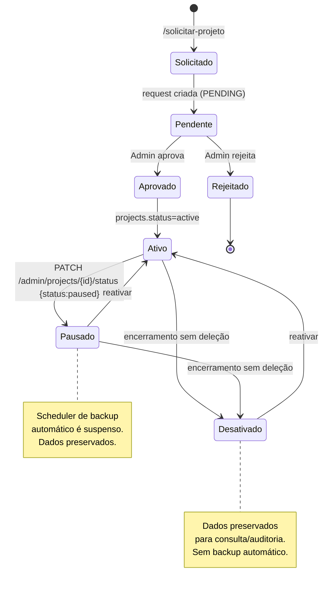
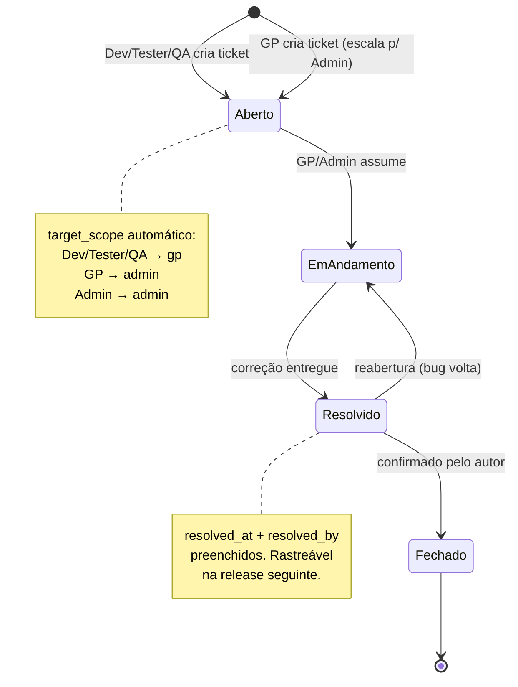
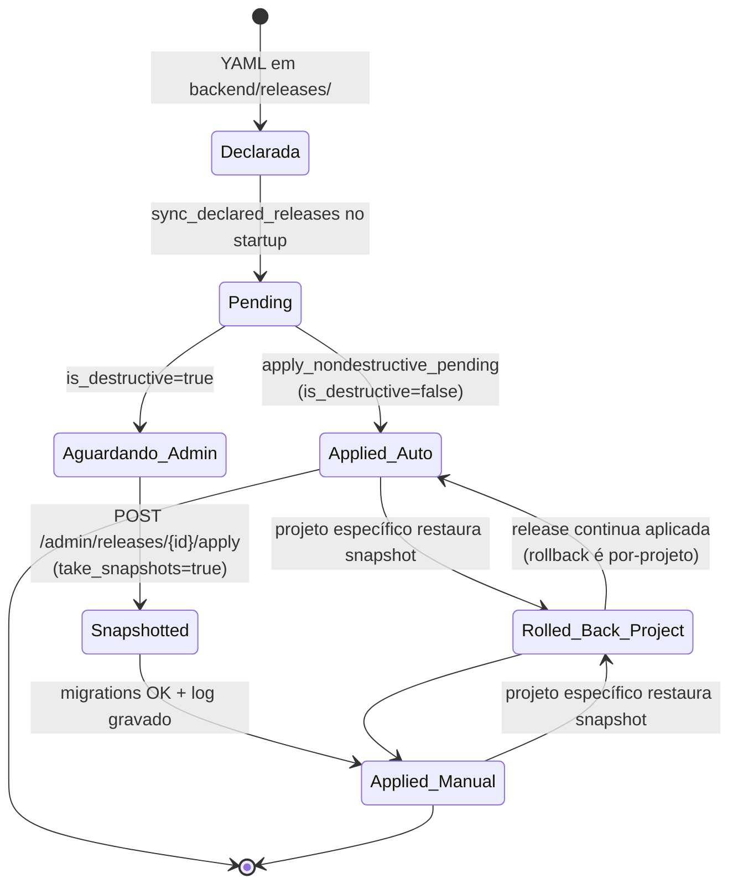
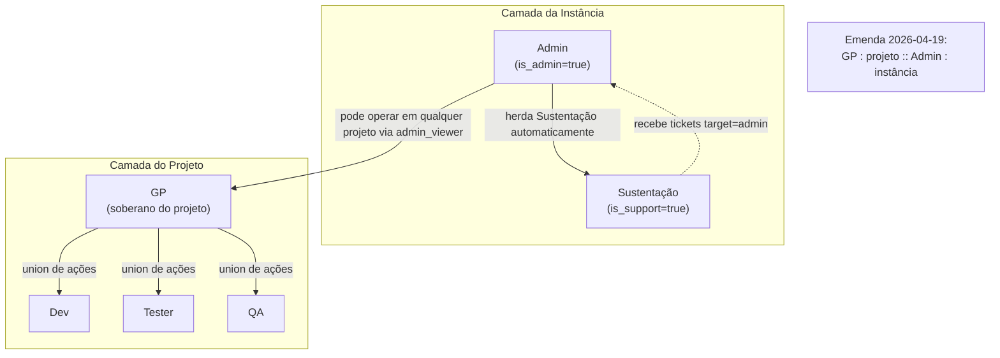

# GCA — Apresentação Comercial

**Gestão de Codificação Assistida / Gerenciador Central de Arquiteturas**

> Documento-fonte para criação da apresentação institucional do produto.
> Este arquivo reúne o material completo: funcionalidades, diagramas (códigos Mermaid para render em qualquer ferramenta), pontos de inserção de imagens, glossário alfabético e limites honestos do produto.

**Autor:** Luiz Carlos Pielak
**Versão do documento:** 1.0 — 2026-04-19
**Versão do produto:** 1.0 (MVPs 1-7 + Emenda fechados)

---

## Índice

1. [Resumo executivo](#1-resumo-executivo)
2. [O que o GCA resolve](#2-o-que-o-gca-resolve)
3. [Visão arquitetural em uma página](#3-visão-arquitetural-em-uma-página)
4. [Compartimentalização por projeto](#4-compartimentalização-por-projeto)
5. [Papéis canônicos (RBAC)](#5-papéis-canônicos-rbac)
6. [Área Administrativa — funcionalidades](#6-área-administrativa--funcionalidades)
7. [Área de Projeto — funcionalidades](#7-área-de-projeto--funcionalidades)
8. [Diagramas de sequência](#8-diagramas-de-sequência)
9. [Diagramas de fluxo e estado](#9-diagramas-de-fluxo-e-estado)
10. [Segurança e proteção de código](#10-segurança-e-proteção-de-código)
11. [O que o GCA faz / o que ele ainda não faz](#11-o-que-o-gca-faz--o-que-ele-ainda-não-faz)
12. [Operação, instalação e atualização](#12-operação-instalação-e-atualização)
13. [Roadmap futuro (fora do V1)](#13-roadmap-futuro-fora-do-v1)
14. [Glossário alfabético](#14-glossário-alfabético)

---

## 1. Resumo executivo

O **GCA (Gestão de Codificação Assistida)** é uma plataforma **instalável por cliente** para governança de projetos de desenvolvimento de software assistida por Inteligência Artificial.

O produto cobre o ciclo completo de um projeto:

- **Entrada**: solicitação externa → aprovação administrativa → cadastro do GP.
- **Descoberta**: questionário de 49 perguntas → OCG (Objeto Canônico de Governança) gerado por pipeline de 8 agentes de IA.
- **Validação**: Gatekeeper avalia 7 pilares (Business, Architecture, Stack, Testing, Compliance, Risk, Deliverables).
- **Aprofundamento**: ingestão de documentos → Arguidor → backlog → roadmap.
- **Execução**: CodeGen assistida por IA com scaffolders determinísticos em 7 linguagens (Python, Java, Kotlin, Go, C#, PHP, Node.js).
- **Qualidade**: QA Readiness → revisão de testes → Release Bundle.
- **Operação**: backup diário por projeto, tickets de incidente, releases versionadas com preservação de dados, métricas de IA por projeto.

**Diferenciais:**

- **Uma instância por cliente** — sem SaaS multi-tenant. Dados nunca saem do ambiente do cliente.
- **Compartimentalização dura por projeto** — cada projeto é isolado em banco, IA, storage, auditoria e backup.
- **IA configurável por cliente E por projeto** — suporta Anthropic Claude, OpenAI GPT, Google Gemini, DeepSeek e Ollama local.
- **Governança auditável** — todas as decisões críticas geram entrada em `audit_log_global` com hash chain de integridade.
- **Proteção de código** — sete camadas anti-engenharia-reversa documentadas (Cython compile + PyArmor BCC + obfuscator frontend + verificação de integridade + licença JWT).

**Status atual**: MVPs 1-7 fechados, 732 testes de regressão passando, zero dívida técnica aberta.

---

## 2. O que o GCA resolve

Projetos de desenvolvimento de software em organizações de médio e grande porte enfrentam, tipicamente, os seguintes problemas:

### 2.1. Perda de contexto entre fases

Sem um objeto canônico único, cada fase do projeto (levantamento, arquitetura, codificação, testes, entrega) é conduzida com premissas próprias. O que foi decidido no levantamento se perde até chegar no CodeGen.

**Resposta do GCA**: o **OCG** é a fonte única de verdade do projeto. Todas as fases consultam e evoluem o mesmo objeto. Mudanças geram delta versionado em `ocg_delta_log`.

### 2.2. Governança ad-hoc e difícil de auditar

Aprovações informais, decisões em reuniões sem registro, deliberações por e-mail. Na hora do post-mortem, ninguém encontra "quem aprovou o quê".

**Resposta do GCA**: cada decisão crítica gera evento em `audit_log_global` com **hash chain** — qualquer adulteração invalida a cadeia. Governança e compliance ganham base factual.

### 2.3. Escolha de IA acoplada ao produto

Muitas plataformas casam com um único provedor de IA, forçando o cliente a aceitar a escolha do fornecedor. Isso quebra quando o cliente tem política de dados, custo ou compliance diferente.

**Resposta do GCA**: política explícita de **roteamento híbrido por criticidade** (alta → modelo premium; baixa → local/barato) e **configuração por instância e por projeto**. O cliente decide qual provedor vai processar cada projeto dele.

### 2.4. Dependência de conhecimento tácito do GP

Gerente de Projeto é gargalo — ele sabe "como fazer" mas não existe sistema que codifique esse saber. Quando sai, o projeto trava.

**Resposta do GCA**: o pipeline GCA transforma o conhecimento do GP em artefatos auditáveis (OCG, backlog, roadmap, Documentação Viva). Mesmo com troca de GP, o projeto continua rastreável.

### 2.5. Tickets de suporte perdidos em canais paralelos

Bug reportado por e-mail, urgência no Slack, feature solicitada em reunião — nada fica centralizado e o ciclo "ticket → correção → release" não é rastreável.

**Resposta do GCA**: módulo de **Tickets de Incidente** (MVP 6) com roteamento automático por papel (Dev/Tester/QA → GP; GP → Admin + Sustentação). Cada ticket tem categoria, prioridade, seção onde ocorreu, fluxo executado e anexos (até 5 arquivos, 10 MB). O MVP 7 amarra tickets resolvidos às releases seguintes (`ref_id=TICKET-{id}`).

### 2.6. Atualizações que destroem dados do cliente

Release nova aplica migration destrutiva e os dados preenchidos pelo cliente se perdem ou ficam inconsistentes.

**Resposta do GCA**: **MVP 7 — Entrega versionada preservando dados do usuário**. Releases não-destrutivas aplicadas automaticamente; destrutivas exigem confirmação do Admin e geram **snapshot automático por projeto** antes de aplicar. Rollback por-projeto disponível via DT-063.

### 2.7. Ausência de backup automático e recuperação

Cliente esquece de fazer backup, ou faz sem consistência, ou perde dados por falha de disco.

**Resposta do GCA**: **Backup automático diário às 12:00** de cada projeto ativo. Retenção de 10 backups por projeto. Catch-up no startup se faltou algum. GP dispara backup manual. Admin dispara backup em qualquer projeto. Restore com validação SHA-256 e preservação de `audit_log_global`.

---

## 3. Visão arquitetural em uma página

```
┌─────────────────────────────────────────────────────────────────────┐
│                                                                     │
│                      INSTÂNCIA DO GCA (1 cliente)                   │
│                                                                     │
│   ┌─────────────────────┐        ┌─────────────────────┐            │
│   │  Camada Instância   │        │  Camada Projeto     │            │
│   │  (visão global)     │        │  (compartimento)    │            │
│   │                     │        │                     │            │
│   │  • Admin            │        │  • GP (soberano)    │            │
│   │  • Sustentação      │  ◀──▶  │  • Dev              │            │
│   │  • Config. geral    │ tickets│  • Tester           │            │
│   │  • Provedores IA    │release │  • QA               │            │
│   │  • Métricas global  │        │  • OCG, pipeline    │            │
│   │  • Backups agrega.  │        │  • IA do projeto    │            │
│   │  • Audit global     │        │  • Backups próprios │            │
│   │  • Releases         │        │  • Audit próprio    │            │
│   └─────────────────────┘        └─────────────────────┘            │
│           ▲                              ▲                          │
│           │                              │                          │
│           │                              │                          │
│   ┌───────┴─────────┐            ┌───────┴──────────┐               │
│   │ PostgreSQL 15   │            │ Provedores IA    │               │
│   │ Volumes Docker  │            │ (Anthropic /     │               │
│   │ nomeados:       │            │  OpenAI /        │               │
│   │ • gca-postgres  │            │  Google /        │               │
│   │ • gca-uploads   │            │  DeepSeek /      │               │
│   │ • gca-backups   │            │  Ollama local)   │               │
│   └─────────────────┘            └──────────────────┘               │
│                                                                     │
└─────────────────────────────────────────────────────────────────────┘

  Estação do cliente (Windows 10/11 ou Ubuntu 22.04+)
  Docker Desktop / Docker CE + Compose
  Sem ligação direta com outras instâncias do GCA
```

**Cada cliente roda seu próprio GCA.** Não há comunicação entre instâncias. A figura acima é a unidade operacional.

> 📸 **INSERIR AQUI:** diagrama arquitetural acima renderizado de forma mais rica (uso em slide final). Sugestão: recriar no Figma/Miro/Lucidchart usando os elementos citados.

---

## 4. Compartimentalização por projeto

O GCA adota **compartimentalização dura** como princípio arquitetural. Cada projeto é um compartimento isolado em **seis dimensões**:

| Dimensão | Como é compartimentalizado |
|----------|----------------------------|
| **Banco de dados** | Todas as tabelas que carregam dado de projeto têm `project_id` obrigatório no predicado (30+ tabelas). Nenhuma query cross-projeto é permitida fora dos endpoints administrativos. |
| **Provedores de IA** | Cada projeto pode ter provedor próprio (Anthropic, OpenAI, Gemini, DeepSeek ou Ollama local) com chave de API criptografada via Fernet, isolada no vault do projeto. |
| **Storage** | Uploads de ingestão, anexos de tickets e bundles de release ficam em `gca-uploads-storage` prefixados por `/incidents/{ticket_id}/` ou `/projects/{project_id}/`. |
| **Backups** | Cada projeto gera seu próprio backup compartimentalizado (29 tabelas filtradas por `project_id`, empacotadas em zip com manifest.json + sha256). Retenção independente. |
| **Auditoria** | `audit_log_global` registra eventos globais (com hash chain); logs de pipeline e de operação ficam por-projeto. `resource_id=project_id` permite filtragem. |
| **E-mail / SMTP** | Cada projeto pode configurar SMTP próprio (servidor, porta, credenciais, FROM) para notificações. Fallback global se não configurar. |

**O único canal cross-projeto** é o **endpoint administrativo** (`/admin/*`), acessível apenas a Admin e Equipe Sustentação para tickets escalados.

**Implicação comercial**: um cliente com 50 projetos tem 50 "ilhas" operacionais dentro da mesma instância. Falha em um projeto (ou comprometimento de chave de IA) não contamina os outros.

---

## 5. Papéis canônicos (RBAC)

O GCA implementa cinco papéis canônicos + papel virtual, organizados em duas camadas soberanas:

### Camada da instância

| Papel | Flag | Escopo | Função |
|-------|------|--------|--------|
| **Admin** | `is_admin=true` | Cross-projeto | Configura a instância, aprova projetos, gerencia usuários, aplica releases destrutivas. Não atua operacionalmente em projetos. |
| **Sustentação** | `is_support=true` | Cross-projeto (leitura) | Recebe tickets escalados a Admin. Pode atuar no atendimento sem ganhar poderes administrativos. Admin herda Sustentação automaticamente. |

### Camada do projeto

| Papel | Escopo | Função |
|-------|--------|--------|
| **GP (Gerente de Projeto)** | Projeto (soberano) | **Pós-emenda 2026-04-19:** soberano do projeto. Tem **união das ações** de Dev, Tester e QA. Conduz o projeto, aprova módulos e OCG, convida time, opera todos os fluxos quando necessário. |
| **Dev** | Projeto | Implementa código, opera ingestão, Arguidor, CodeGen e commits. Não aprova módulo no Gatekeeper. |
| **Tester** | Projeto | Cria, edita e executa testes. Registra evidências. |
| **QA** | Projeto | Revisa e aprova resultados. Valida qualidade final, segurança e compliance. Não edita conteúdo de teste. |
| **admin_viewer** | Virtual | Atribuído a Admin que acessa projeto sem membership. Vê projeto; não atua. |

> 📸 **INSERIR AQUI:** diagrama visual da hierarquia RBAC (está pronto em `docs/diagrams/rbac_papeis.png`). Código Mermaid também disponível em `docs/diagrams/rbac_papeis.mmd`.

**Regra dura de assimetria:**

> **GP : projeto :: Admin : instância**
>
> Admin herda Sustentação. GP nunca herda Admin automaticamente — promoção a Admin é caminho separado (`/admin/users` → Promover).

---

## 6. Área Administrativa — funcionalidades

A área administrativa é acessada por usuários com `is_admin=true` (ou `is_support=true` para subset de telas). Ao logar via `/login`, a sidebar renderiza a seção **ADMINISTRAÇÃO**.

### 6.1. Login Administrador

Login via `/login` com e-mail e senha. Retorna JWT. Senhas armazenadas com bcrypt. Sem refresh token nesta versão.

> 📸 **INSERIR AQUI:** `screenshots_v3/01_publica_login_admin.png`
> *Legenda: Tela de login do Administrador.*

### 6.2. Dashboard Global

Primeira tela após login. Agrega contadores: projetos ativos por status, total de tickets abertos, releases recentes, tendência de uso de IA últimas 24h.

> 📸 **INSERIR AQUI:** `screenshots_v3/10_admin_dashboard_global.png`
> *Legenda: Dashboard Global com KPIs cross-projeto.*

### 6.3. Gestão de Projetos

Lista todos os projetos da instância com badges de lifecycle (**Ativo**, **Pausado**, **Desativado**, **Excluído-órfão**). Ações por linha:

- **Pausar** — suspende temporariamente; scheduler de backup automático para.
- **Desativar** — encerramento sem deleção; dados preservados para consulta.
- **Reativar** — volta projeto ao estado ativo.
- **Limpar órfão** — remove solicitação aprovada cujo projeto foi deletado (botão vermelho destacado).
- **Substituir GP** — troca Gerente de Projeto preservando o projeto.
- **Mensagem ao solicitante** — comunica rejeição/ajuste.

> 📸 **INSERIR AQUI:** `screenshots_v3/11_admin_gestao_projetos.png`
> *Legenda: Gestão de Projetos com badges de lifecycle e botões de ação (Pausar, Desativar, Reativar, Limpar órfão).*

### 6.4. Visão Admin do Projeto

Admin pode entrar em qualquer projeto (mesmo sem membership) com papel virtual `admin_viewer`. Vê o projeto sem poder atuar operacionalmente. Útil para fiscalizar/diagnosticar.

> 📸 **INSERIR AQUI:** `screenshots_v3/12_admin_projeto_visao_admin.png`
> *Legenda: Visão Admin entrando em projeto sem ser membro operacional.*

### 6.5. Gestão de Usuários

Lista todos os usuários da instância. Ações:

- **Promover a Admin** — ícone Shield. Confirma via dialog.
- **Rebaixar de Admin** — ícone ShieldOff. Bloqueia auto-rebaixa do último admin ativo (regra anti-órfão).
- **Excluir usuário** — ícone Lixeira. Não permite auto-exclusão.
- **Ativar/Desativar** — ícone Zap.
- **Convidar Administrador** — botão superior direito (ver 6.6).

Badges por linha mostram: papéis em projetos (GP/Dev/Tester/QA) + "Admin (sistema)" quando `is_admin=true`.

> 📸 **INSERIR AQUI:** `screenshots_v3/13_admin_gestao_usuarios.png`
> *Legenda: Gestão de Usuários com promoção de Admin, exclusão e gestão de papéis por projeto.*

### 6.6. Convidar Administrador (modal)

Modal acionado pelo botão "Convidar Administrador" em `/admin/users`. Campos: nome completo + e-mail. O sistema:

1. Se o e-mail já existe → promove o usuário existente a Admin (sem mexer na senha).
2. Se não existe → cria usuário novo com senha temporária aleatória + tenta enviar e-mail via `send_admin_invitation_email`.
3. Se SMTP falhar, a senha temporária é exibida inline na tela para o Admin copiar manualmente (com aviso "não volta a aparecer").

> 📸 **INSERIR AQUI:** `screenshots_v3/14_admin_convidar_admin_modal.png`
> *Legenda: Modal de convite de Administrador com fallback de senha inline.*

### 6.7. Auditoria Global

Todos os eventos críticos da instância (login admin, criação/aprovação de projeto, promoção/rebaixamento, aplicação de release, restore de backup, etc.) registrados em `audit_log_global` com **hash chain** (cada registro tem `previous_hash` apontando para o `current_hash` do anterior). Qualquer adulteração posterior invalida a cadeia.

Filtros: janela temporal (1h, 24h, 7d, 30d, 720h), tipo de evento, usuário ator, projeto relacionado.

> 📸 **INSERIR AQUI:** `screenshots_v3/15_admin_auditoria_global.png`
> *Legenda: Auditoria Global com hash chain de integridade.*

### 6.8. Métricas Operacionais

Dashboard de uso de IA em toda a instância. Seções:

- **Totais consolidados** — chamadas, tokens in/out, custo USD na janela.
- **Uso de IA por provider × operation** — tabela global ordenada por custo.
- **Uso de IA por projeto (breakdown)** — 1 linha por projeto com consumo na janela. Colunas: nome, status (badge Ativo/Pausado/Desativado), chamadas, tokens, custo. Ordenado por custo decrescente.
- **Eventos de auditoria top 20** — event_type + count.
- **Projetos por status** + **Usuários ativos/inativos/admin**.

Seletor de janela: 1h / 24h / 7d / 30d.

> 📸 **INSERIR AQUI:** `screenshots_v3/16_admin_metricas.png`
> *Legenda: Métricas com breakdown compartimentalizado por projeto.*

### 6.9. Backups (visão agregada)

Lista todos os backups de todos os projetos da instância. Filtros: projeto, status (running, completed, failed), trigger source (scheduled, manual_gp, manual_admin, startup_catchup).

Quick action: **"Disparar backup imediato para projeto X a pedido do GP"** — Admin dispara backup manual em qualquer projeto.

> 📸 **INSERIR AQUI:** `screenshots_v3/17_admin_backups.png`
> *Legenda: Backups agregados com filtros e quick action.*

### 6.10. Incidentes (tickets escalados)

Lista agregada cross-projeto de tickets com `target_scope='admin'` (abertos por GPs ou por outros Admins). Filtros por status e projeto. Admin e Sustentação veem a mesma lista.

> 📸 **INSERIR AQUI:** `screenshots_v3/18_admin_incidents.png`
> *Legenda: Tickets escalados ao Admin + Sustentação.*

### 6.11. Equipe Sustentação

Administra a flag `is_support`. Lista membros atuais (Admin + Support). Promove usuário comum a Support via busca + botão "Adicionar". Admin pode marcar a si mesmo como Support explícito ou deixar a herança implícita.

**Regra dura**: a UI **não** promove Support a Admin — esse fluxo fica na gestão canônica de usuários (`/admin/users`).

> 📸 **INSERIR AQUI:** `screenshots_v3/19_admin_equipe_sustentacao.png`
> *Legenda: Equipe Sustentação com herança automática para Admins.*

### 6.12. Releases

Lista de releases aplicadas e pendentes. Releases destrutivas destacadas em âmbar. Cada release mostra: tag semântica (v0.8.0, v0.9.0), título, status (pending/applied/rolled_back), número de items de changelog, data de aplicação, YAML de origem.

Releases não-destrutivas são aplicadas automaticamente no startup do backend. Destrutivas ficam em `pending` até Admin clicar em "Aplicar com snapshot" (ver 6.13).

> 📸 **INSERIR AQUI:** `screenshots_v3/20_admin_releases.png`
> *Legenda: Releases com separação pendentes/aplicadas.*

### 6.13. Detalhe de Release com aplicação destrutiva

Ao clicar numa release, o Admin vê:

- **Items do changelog** — com tipo (MVP, MVP emenda, ticket, feature, fix, schema change), `ref_id` (MVP6-E, DT-063, TICKET-xxx) e `affected_roles` (quem vai ver essa mudança).
- **Log de aplicação** — timestamps de eventos: `applied`, `snapshot_taken`, `rolled_back`, `completion_task_fulfilled`.
- **Botão "Aplicar com snapshot"** — em releases destrutivas pending. Quando acionado:
  1. Confirma via dialog.
  2. Chama `create_backup` (DT-063) para cada projeto ativo.
  3. Registra `snapshot_taken` no log por projeto.
  4. Marca release como `applied`.

> 📸 **INSERIR AQUI:** `screenshots_v3/21_admin_release_detail.png`
> *Legenda: Detalhe da release com items + log + botão aplicar (destrutiva).*

### 6.14. Changelog (user-facing)

Acessível via ícone ✨ no topbar. Lista releases aplicadas com changelog segmentado por papel: Admin vê tudo; GP vê itens com `affected_roles` incluindo `gp` ou `all`; Dev/Tester/QA idem. Emojis por tipo de item: 🚀 MVP, 🔧 emenda, 🎫 ticket, ✨ feature, 🐛 fix.

> 📸 **INSERIR AQUI:** `screenshots_v3/25_global_changelog_user_admin.png`
> *Legenda: Changelog segmentado por papel (visto aqui como Admin).*

---

## 7. Área de Projeto — funcionalidades

Usuários com `is_admin=false` (Dev, Tester, QA, GP) entram na instância via `/p/{short_slug}` — **ProjectLoginPage**. Após autenticar, são levados direto ao `/projects/{id}`.

A sidebar renderiza a seção **MEUS PROJETOS** com o projeto ativo expandido exibindo 18 sub-itens. A seção **ADMINISTRAÇÃO** não aparece.

### 7.1. Login via projeto (ProjectLoginPage)

Acessível em `/p/{short_slug}` — o short_slug é gerado automaticamente a partir do nome do projeto. O endpoint público `/projects/by-slug/{short_slug}` retorna resumo do projeto (nome, status); o form de login usa o contexto do projeto para fazer `projectLogin` e direciona ao dashboard correto.

> 📸 **INSERIR AQUI:** `screenshots_v3/02_publica_login_projeto.png`
> *Legenda: Tela de login via projeto (ProjectLoginPage) — entrada contextualizada por slug.*

### 7.2. Lista de projetos (visão do GP)

Segmentada pela `project_memberships` do usuário: lista apenas os projetos onde ele é membro aceito. GP pode ser membro de múltiplos projetos simultaneamente.

> 📸 **INSERIR AQUI:** `screenshots_v3/30_projeto_gp_lista_projetos.png`
> *Legenda: Lista de projetos visível ao GP (sem menu administrativo).*

### 7.3. Dashboard do projeto

Entrada principal do projeto. KPIs do projeto: saúde do OCG, readiness por pilar, últimos deltas, backlog priorizado, pendências pós-release, consumo de IA do projeto nas últimas 24h.

> 📸 **INSERIR AQUI:** `screenshots_v3/31_projeto_gp_dashboard.png`
> *Legenda: Dashboard do projeto com sidebar de MEUS PROJETOS expandida (18 sub-itens).*

### 7.4. Equipe

Gestão de membros do projeto. GP convida Dev, Tester, QA por e-mail. Sistema permite **multi-papel** (um usuário pode ser Dev e Tester simultaneamente no mesmo projeto, por exemplo).

> 📸 **INSERIR AQUI:** `screenshots_v3/32_projeto_gp_team.png`
> *Legenda: Equipe do projeto — convites, papéis, multi-papel.*

### 7.5. OCG (Objeto Canônico de Governança)

Fonte única de verdade do projeto. Gerado inicialmente pelo pipeline de 8 agentes de IA a partir do questionário aprovado. Estrutura:

- **PROJECT_PROFILE** — tipo de projeto, criticidade, usuários-alvo.
- **STACK_RECOMMENDATION** — linguagens, frameworks, banco, cache, messaging, IA.
- **ARCHITECTURE_OVERVIEW** — profile arquitetural, execução, multi-tenant, HA.
- **PILLAR_SCORES** — 7 pilares com score 0-100 e status.
- **COMPOSITE_SCORE** — agregação + status (READY / NEEDS_REVIEW / AT_RISK / BLOCKED).
- **TESTING** — estratégia, quality gate, cobertura alvo.
- **COMPLIANCE** — controles aplicáveis.
- **DELIVERABLES** — artefatos esperados + formatos de saída.
- **RISK** — riscos estruturais identificados.
- **APPROVAL_STATUS** — bloqueios ativos.

Toda mudança relevante versionada em `ocg_delta_log` com snapshot completo.

> 📸 **INSERIR AQUI:** `screenshots_v3/33_projeto_gp_ocg.png`
> *Legenda: OCG — Objeto Canônico de Governança com 7 pilares.*

### 7.6. Repositórios externos

Lista de repositórios Git vinculados ao projeto (GitHub/GitLab/Bitbucket) via PAT criptografada com Fernet. Cada repo externo pode disparar o Arguidor quando houver commits novos.

> 📸 **INSERIR AQUI:** `screenshots_v3/34_projeto_gp_external_repos.png`
> *Legenda: Repositórios externos — integração Git com PAT criptografada.*

### 7.7. Ingestão

Upload de documentos (PDF, DOCX, TXT, MD) para análise. Detector de PII aplica quarentena quando detecta dados pessoais; GP pode liberar manualmente falsos-positivos. Documentos ingeridos alimentam o Arguidor.

> 📸 **INSERIR AQUI:** `screenshots_v3/35_projeto_gp_ingestion.png`
> *Legenda: Ingestão de documentos com quarentena PII.*

### 7.8. Gatekeeper

Avaliação por sete pilares. Cada pilar tem thresholds parametrizáveis pelo Admin. Bloqueia avanço de fase quando pilar crítico não atinge o mínimo. Findings geram items de backlog.

> 📸 **INSERIR AQUI:** `screenshots_v3/36_projeto_gp_gatekeeper.png`
> *Legenda: Gatekeeper avaliando 7 pilares com thresholds.*

### 7.9. Arguidor

Módulo de análise profunda de documentos ingeridos via LLM. Gera findings classificados por severidade (BLOCKER, CRITICAL, WARNING, INFO). Usa o provedor de IA configurado no projeto.

> 📸 **INSERIR AQUI:** `screenshots_v3/37_projeto_gp_arguider.png`
> *Legenda: Arguidor — análise LLM de documentos com findings por severidade.*

### 7.10. Geração de Código (CodeGen)

Gera estrutura inicial do projeto com base no OCG. Suporta 7 linguagens via scaffolders determinísticos:

- **Java/Spring Boot** — pom.xml, Application.java, application.yml, tests.
- **Java/Quarkus** — pom.xml, GreetingResource.java, application.properties.
- **Kotlin/Spring** — build.gradle.kts, Application.kt, tests.
- **Go** — go.mod, cmd/server/main.go, internal/server, tests.
- **C#/.NET 8** — .sln, .csproj, Program.cs, xUnit tests.
- **PHP/Laravel 11** — composer.json, artisan, Controllers, PHPUnit tests.
- **Node.js/NestJS** — nest-cli.json, AppModule, controllers, Jest tests.
- **Python** — geração via LLM (sem scaffolder determinístico por design).

Todo arquivo gerado carrega marcador `[gca:auto]`. GP pode operar CodeGen após emenda RBAC 2026-04-19.

> 📸 **INSERIR AQUI:** `screenshots_v3/38_projeto_gp_codegen.png`
> *Legenda: Geração de Código com scaffolders para 7 linguagens.*

### 7.11. QA Readiness

Estado de prontidão de QA com cobertura por pilar. Derivado automaticamente do OCG + testes executados + evidências.

> 📸 **INSERIR AQUI:** `screenshots_v3/39_projeto_gp_qa_readiness.png`
> *Legenda: QA Readiness — cobertura de testes por pilar.*

### 7.12. Revisão de Testes

Workflow de aprovação: Tester registra teste executado com evidência; QA revisa e aprova ou rejeita. Toda decisão auditada.

> 📸 **INSERIR AQUI:** `screenshots_v3/40_projeto_gp_tester_review.png`
> *Legenda: Revisão de Testes — fluxo Tester → QA.*

### 7.13. Backlog

Items derivados do OCG + findings do Arguidor, priorizados. Cada item tem tipo, descrição, pilar relacionado, status.

> 📸 **INSERIR AQUI:** `screenshots_v3/41_projeto_gp_backlog.png`
> *Legenda: Backlog priorizado do projeto.*

### 7.14. Roadmap

Visão temporal das entregas. Consolidação do backlog em timeline.

> 📸 **INSERIR AQUI:** `screenshots_v3/42_projeto_gp_roadmap.png`
> *Legenda: Roadmap do projeto.*

### 7.15. Documentação Viva

Documentação gerada automaticamente a partir do OCG e atualizada a cada mudança relevante. Documentos incluem: Arquitetura, Stack, Testing Strategy, Compliance, Risk Assessment, Deliverables.

> 📸 **INSERIR AQUI:** `screenshots_v3/43_projeto_gp_docs.png`
> *Legenda: Documentação Viva — sincronização automática com OCG.*

### 7.16. Definition of Done (Readiness)

Checklist de critérios de entrega final. Quando todos os critérios atendidos, libera geração do **Release Bundle** (pacote consolidado de artefatos do projeto).

> 📸 **INSERIR AQUI:** `screenshots_v3/44_projeto_gp_readiness.png`
> *Legenda: Definition of Done — critérios de Release Bundle.*

### 7.17. Configurações do projeto

Três tabs:

- **Questionário** — upload/re-upload do PDF de questionário (49 perguntas).
- **Repositório** — configuração de Git principal + PAT criptografada.
- **Provedor de IA** — configuração do provedor LLM do projeto (override do provedor global da instância). Aceita Ollama com `base_url` + api_key opcional.

> 📸 **INSERIR AQUI:** `screenshots_v3/45_projeto_gp_settings.png`
> *Legenda: Configurações do projeto — Questionário, Repositório, Provedor de IA.*

### 7.18. Pipeline Audit

Logs de auditoria específicos do projeto. Filtros por módulo (OCG, Ingestão, Arguidor, CodeGen, QA, Release) e por ator.

> 📸 **INSERIR AQUI:** `screenshots_v3/46_projeto_gp_audit.png`
> *Legenda: Pipeline Audit — logs do projeto por módulo.*

### 7.19. Backups do projeto

Lista de backups do projeto. Botão "Backup agora" (Admin ou GP). Botão "Reverter a este ponto" em cada backup (restore com confirmação). Download `.zip`.

Polling a cada 3 segundos quando existe backup em `running`.

> 📸 **INSERIR AQUI:** `screenshots_v3/47_projeto_gp_backups.png`
> *Legenda: Backups do projeto com rollback e download.*

### 7.20. Incidentes do projeto

Tickets abertos pelo time do projeto. Filtros por status e prioridade. Listagem segmentada por papel:

- **Dev, Tester, QA** — veem apenas os próprios tickets.
- **GP** — vê todos os tickets `target_scope='gp'` do projeto dele.

Botão "Abrir ticket" leva ao modal de abertura.

> 📸 **INSERIR AQUI:** `screenshots_v3/48_projeto_gp_incidents.png`
> *Legenda: Incidentes do projeto — listagem segmentada por papel.*

### 7.21. Modal de abertura de ticket

Formulário com campos obrigatórios:

- **Título** — até 200 caracteres.
- **Categoria** — bug, dúvida, pedido de feature, incidente de pipeline.
- **Prioridade** — baixa, média, alta, crítica.
- **Descrição** — texto livre.
- **Seção onde o erro ocorreu** — autopreenchida pela rota atual (`window.location.pathname`), editável.
- **Fluxo executado** — OBRIGATÓRIO. Modal recusa abertura se vazio.
- **Anexos** — até 5 arquivos, 10 MB cada, tipos: png, jpg, jpeg, webp, gif, txt, log, json, pdf.

Roteamento automático por papel:

- Dev/Tester/QA → `target_scope=gp` → GPs do projeto recebem notificação.
- GP → `target_scope=admin` → Admins + Sustentação recebem.

> 📸 **INSERIR AQUI:** `screenshots_v3/49_projeto_gp_abrir_ticket_modal.png`
> *Legenda: Modal Abrir Ticket com seção/fluxo obrigatório e anexos.*

### 7.22. Métricas do Projeto

Dashboard operacional do projeto: uso de IA do projeto (chamadas, tokens, custo), eventos de audit do projeto. Acessível a Admin, Sustentação e qualquer membro aceito do projeto. Seletor de janela: 24h / 7d / 30d.

> 📸 **INSERIR AQUI:** `screenshots_v3/50_projeto_gp_metrics.png`
> *Legenda: Métricas compartimentalizadas do projeto.*

### 7.23. Changelog (user-facing) — visto pelo GP

Acessível pelo ícone ✨ no topbar. O mesmo endpoint `/releases` segmenta o changelog pelo papel do usuário. GP vê items relevantes ao projeto dele; Dev, Tester, QA idem.

> 📸 **INSERIR AQUI:** `screenshots_v3/55_global_gp_changelog_user.png`
> *Legenda: Changelog visto pelo GP — segmentação por papel.*

---

## 8. Diagramas de sequência

Os códigos Mermaid abaixo podem ser colados em qualquer ferramenta que renderize Mermaid (Notion, Confluence, Obsidian, Mermaid Live Editor, GitLab/GitHub rendering, etc.). PNGs já renderizados estão em `docs/diagrams/`.

### 8.1. Login Administrador



### 8.2. Login via projeto (ProjectLoginPage)



### 8.3. Criação e aprovação de projeto



### 8.4. Geração do OCG (pipeline de 8 agentes)



### 8.5. Rastreabilidade Ticket → Release



### 8.6. Backup diário e restore



---

## 9. Diagramas de fluxo e estado

### 9.1. Ciclo de vida do projeto



### 9.2. Ciclo de vida do ticket



### 9.3. Ciclo de vida da release



### 9.4. RBAC — hierarquia de papéis



---

## 10. Segurança e proteção de código

### 10.1. Princípio honesto

Não existe proteção absoluta contra engenharia reversa em código que roda na máquina do cliente. O GCA implementa **sete camadas** que elevam o custo de reversão a ponto de torná-la economicamente inviável para cliente médio.

### 10.2. As sete camadas

| # | Camada | O que faz | Ganho |
|---|--------|-----------|-------|
| 1 | **Cython compile** | Python `.py` → `.c` → binário `.so` (Linux) / `.pyd` (Windows) | Decompile via uncompyle6 não funciona; só Ghidra/IDA, que produz pseudo-C ilegível. |
| 2 | **PyArmor BCC wrapper** | Wrapper adicional em módulos sensíveis (auth, vault, LLM key resolver) | Runtime check; módulo só carrega no contexto esperado. |
| 3 | **Imagens Docker multi-stage** | Stage builder separado do runtime; sem toolchain na imagem final | Atacante com shell no container não encontra gcc/g++ para recompilar. |
| 4 | **Registry privado autenticado** | Imagens em `registry.gca-produto.com` com tokens rotacionáveis | Quem não é autorizado não baixa. |
| 5 | **JavaScript-obfuscator frontend** | Control-flow flattening + string array base64 + dead code injection | Bundle JS vira ilegível (`_0x5e4f`, switch-case com estado, strings em array). |
| 6 | **Integrity check no startup** | Backend calcula SHA-256 dos `.so` em runtime e compara com manifest assinado | Modificação em qualquer binário quebra o SHA e aborta startup. |
| 7 | **Licença JWT com expiração** | JWT assinado com chave privada, validado no startup | Sem JWT válido, aplicação não sobe; expiração atingida bloqueia até renovar. |

### 10.3. O que **não** é feito (transparência)

- **Sem atestação remota** (remote attestation).
- **Sem secure enclave** (Intel SGX, ARM TrustZone).
- **Sem criptografia do .so em repouso** — só o código-fonte deixa de ser Python legível.
- **JWT da licença pode ser capturado** por atacante com acesso root ao host (defesa: responsabilidade do cliente, item 3.1 do EULA).

Documento completo: `docs/ANTI_REVERSE_ENGINEERING.md`.

---

## 11. O que o GCA faz / o que ele ainda não faz

### 11.1. O que o GCA **faz** (V1)

**Gestão de projeto:**
- Cadastro e aprovação de projetos via wizard externo + aprovação admin.
- Multi-projeto por instância, compartimentalizado.
- Lifecycle (ativo, pausado, desativado) sem perda de dados.
- Limpeza de solicitações órfãs.

**RBAC:**
- 5 papéis canônicos (Admin, GP, Dev, Tester, QA) + Sustentação via flag.
- Multi-papel por projeto.
- GP soberano do projeto (emenda 2026-04-19).
- Anti-órfão no último Admin.

**Inteligência Artificial:**
- Provedor configurável por instância e por projeto.
- Suporte: Anthropic Claude, OpenAI GPT, Google Gemini, DeepSeek, Ollama local.
- Roteamento por criticidade (alta → premium; baixa → local/barato).
- Registro de uso em `ai_usage_log` (tokens, custo, operação) por projeto.

**Pipeline de projeto:**
- Questionário de 49 perguntas (PDF AcroForm).
- Pipeline de 8 agentes de IA gerando OCG.
- Gatekeeper com 7 pilares e thresholds parametrizáveis.
- Ingestão de documentos com quarentena PII.
- Arguidor com análise LLM.
- Backlog derivado do OCG + findings.
- Roadmap.
- CodeGen com scaffolders em 7 linguagens (Java/Spring+Quarkus, Kotlin/Spring, Go, C#/.NET 8, PHP/Laravel 11, Node.js/NestJS, Python via LLM).
- QA Readiness + revisão Tester/QA.
- Documentação Viva sincronizada com OCG.
- Release Bundle ao fim do projeto.

**Operação:**
- Backup automático diário às 12:00 por projeto.
- Retenção de 10 backups por projeto.
- Catch-up no startup.
- Restore com validação SHA-256 e preservação de auditoria.
- Upgrade idempotente (`scripts/upgrade.sh` com 9 etapas).
- Script de restore com dupla confirmação.

**Tickets de incidente:**
- Roteamento automático por papel (Dev/Tester/QA → GP; GP → Admin + Sustentação).
- Seção de ocorrência autopreenchida pela rota.
- Fluxo executado obrigatório.
- Anexos (5 arquivos, 10 MB, 9 tipos).
- Comentários, mudança de status, notificação in-app.
- Auditoria compartimentalizada.

**Releases:**
- Declarativas via YAML shipado com o código.
- Aplicação automática de não-destrutivas no startup.
- Destrutivas exigem confirmação + snapshot automático por projeto.
- Rollback por-projeto preservando auditoria.
- Changelog segmentado por papel.
- Rastreabilidade ticket → release.
- Completion tasks pós-release (assistente para preencher dados novos).

**Observabilidade:**
- `/metrics/health` público para load balancer.
- `/metrics/dashboard` agregado global (Admin + Sustentação).
- `/metrics/per-project` breakdown por projeto (Admin-only).
- `/projects/{id}/metrics/dashboard` por projeto (membros).
- `/metrics/prometheus` texto para scrape externo.
- Audit log global com hash chain.
- Logs estruturados via structlog.

**Segurança:**
- 7 camadas anti-engenharia-reversa documentadas.
- Credenciais criptografadas com Fernet (PATs, LLM keys).
- Senhas em bcrypt com salt único.
- JWT HS256 com chave por instância.
- Auditoria com integridade verificável.

**Distribuição:**
- Instalador Windows via Inno Setup (10 telas + conclusão).
- Instalador Ubuntu via `install.sh` interativo ou pacote `.deb`.
- Script de build para imagens de produção.

### 11.2. O que o GCA **ainda não faz** (roadmap)

**Recursos pedidos mas fora do V1:**

| Item | Por quê ficou fora do V1 |
|------|--------------------------|
| **Atestação remota** (hardware HSM / TPM) | Fora do escopo — clientes que exigem classe governo/defesa contratam extensão. |
| **SSO corporativo (SAML, OIDC, LDAP)** | Planejado para MVP 8 se o stakeholder autorizar. Login hoje é local com bcrypt. |
| **Refresh token JWT** | JWT atual tem expiração fixa; re-login manual quando expira. |
| **SLA formal de tickets com escalonamento automático** | Escalonamento é manual (GP → Admin via abrir novo ticket). Timeline de SLA visível mas sem gatilho automático. |
| **Anexos em tickets com scan de PII** | Anexos permitidos; responsabilidade de conteúdo sensível é do autor (declarado no EULA). |
| **Integração com Jira/Linear/Zendesk** | Tickets hoje ficam internos. Bridge para ferramentas externas exige projeto dedicado. |
| **E-mail bidirecional** | Notificações saem via SMTP; respostas por e-mail não voltam para o sistema. |
| **Downgrade do container** | `upgrade.sh` só vai pra frente. Downgrade requer `restore.sh` + imagem anterior manualmente. |
| **Compartilhamento automático de correção entre instâncias** | Cada cliente recebe release pelo fluxo de instalação. Sem sincronização central. |
| **Marketplace de plugins / features opt-in** | Escopo fora da V1. |
| **Multi-língua do frontend** | UI hoje é 100% em português brasileiro. Internacionalização requer ajuste dedicado. |
| **Assinatura digital de arquivos no Release Bundle (cadeia X.509)** | Hash SHA-256 presente; PKI formal é projeto próprio. |
| **Auto-upgrade totalmente autônomo** | Upgrade é acionado manualmente via `upgrade.sh`; sem daemon autorrolando. |
| **Dashboards customizáveis por usuário** | Dashboards hoje são fixos (Dashboard Global, Dashboard do Projeto, Métricas). |
| **Exportação de relatórios em PDF/Excel** | Auditoria e métricas são consultáveis via UI; geração PDF/XLSX é projeto futuro. |
| **Billing / cobrança por uso** | Uso de IA é registrado mas não há módulo de cobrança. Cliente lê custo em `/admin/metrics`. |
| **Multi-instância federada** | Cada instância é soberana. Federação entre instâncias não está no V1. |

**Decisões arquiteturais conscientes** (não são "bugs" nem "dívida"):

- Python não tem scaffolder determinístico — é gerado via LLM pela maturidade do ecossistema que já entrega boilerplate pronto.
- Backup usa JSONL via `row_to_json` (não `pg_dump`) porque pg_dump não filtra por WHERE — e compartimentalização por projeto exige filtro.
- Comentários de código em português-BR por decisão de idioma do produto.
- Admin não atua operacionalmente em projetos por separação de responsabilidades — Admin configura a instância, GP conduz o projeto.

---

## 12. Operação, instalação e atualização

### 12.1. Pré-requisitos

**Hardware recomendado:**
- Processador: 4 núcleos 64-bit mínimo (8 recomendado).
- RAM: 8 GB mínimo, 16 GB recomendado.
- Disco: 30 GB livres em SSD (100 GB em NVMe recomendado).

**Software:**
- Windows 10/11 (build 19045+) **ou** Ubuntu 22.04+.
- Docker Desktop (Windows, com WSL 2) ou Docker CE + Compose (Ubuntu).
- Conexão estável com a Internet durante a instalação.

### 12.2. Fluxo de instalação (10 etapas)

1. Boas-vindas
2. Aceite do EULA
3. Chave de ativação
4. Verificação de pré-requisitos
5. Pasta de instalação
6. Porta e domínio
7. Administrador inicial (e-mail + senha)
8. Provedor de IA padrão
9. Resumo
10. Instalação e conclusão

Documento completo: `docs/GCA_Tutorial_Instalacao_v1.docx` com wireframes das 11 telas e screenshots reais.

### 12.3. Atualização

```bash
cd /opt/gca && sudo ./scripts/upgrade.sh
```

O script executa 9 etapas:
1. Backup pré-upgrade completo.
2. `git fetch`.
3. Exit se já está atualizado.
4. `git pull --ff-only`.
5. Build das imagens.
6. Aplicação de migrations.
7. `docker compose up -d --force-recreate`.
8. Health check loop de 60s.
9. Smoke test.

Falha em qualquer etapa cita o comando exato de `restore.sh` para reverter.

### 12.4. Rotina mensal recomendada

- Verificar espaço dos volumes Docker (`docker system df`).
- Conferir contagem de backups por projeto (máx 10 retidos).
- Revisar `/admin/metrics` — custo de IA acumulado, uso por projeto.
- Aplicar releases pendentes em `/admin/releases`.
- Atualizar chave de ativação antes da expiração.

---

## 13. Roadmap futuro (fora do V1)

**Não há data nem compromisso contratual nos itens abaixo**. São candidatos a MVPs futuros sujeitos a decisão do stakeholder do produto.

- **MVP 8 — SSO corporativo** (SAML 2.0 + OpenID Connect + provedor local como fallback).
- **MVP 9 — Relatórios exportáveis** (PDF do OCG, Excel do backlog, PDF do Release Bundle).
- **MVP 10 — Integração externa de tickets** (bridge Jira/Linear/Zendesk).
- **MVP 11 — Marketplace de plugins** (extensões configuráveis por instância).
- **MVP 12 — Federação entre instâncias** (sincronização de benchmarks, trocas autorizadas de conhecimento).
- **MVP 13 — Assinatura digital de artefatos** (PKI X.509 para Release Bundle).
- **MVP 14 — Internacionalização** (pt-BR + en-US + es no V2).

**Protocolo de adição de MVP** (contrato §7.0): stakeholder-soberano autoriza, Claude atualiza contrato + progress em commit atômico, MVP nasce com escopo declarado e só é executado com autorização explícita de início.

---

## 14. Glossário alfabético

**Admin.** Usuário da instância com `is_admin=true`. Soberano da instância; configura provedores, aprova projetos, gerencia usuários, aplica releases destrutivas. Não atua operacionalmente em projetos.

**admin_viewer.** Papel virtual atribuído a Admin quando acessa projeto sem membership. Permite ver o projeto mas não editar conteúdo.

**ai_usage_log.** Tabela que registra cada chamada a provedor de IA com provider, operation, tokens_input, tokens_output, cost_usd. Compartimentalizada por `project_id`.

**Anthropic.** Provedor de IA (Claude). Recomendado para tarefas de alta criticidade no GCA (consolidação do OCG, CodeGen).

**APScheduler.** Biblioteca Python de agendamento assíncrono. Dispara o backup diário às 12:00 e o catch-up no startup.

**Arguidor.** Agente de IA que analisa documentos ingeridos e gera findings classificados (BLOCKER/CRITICAL/WARNING/INFO) para o Gatekeeper.

**audit_log_global.** Tabela de auditoria com hash chain (previous_hash + current_hash). Integridade verificável offline. Preservada mesmo em restore.

**Backup.** Cópia consistente dos dados do projeto. Gerenciado pelo `project_backup_service` (DT-063). Até 10 retidos por projeto. Formato: zip com JSONL de 29 tabelas + manifest.json + sha256.

**Backlog.** Lista de items derivados do OCG + findings do Arguidor, priorizados.

**BCC.** BytecodeCompiler do PyArmor (variante gratuita) usada no empacotamento do GCA.

**Bcrypt.** Algoritmo de hash de senhas utilizado no GCA com salt único por usuário.

**Caddy.** Servidor web com HTTPS automático via Let's Encrypt. Recomendado como proxy reverso em produção.

**Catch-up.** Rotina do scheduler que dispara backup se o último foi há mais de 24h (executada pós-inicialização).

**Changelog.** Lista de items de uma release com kind (mvp, feature, fix, ticket) e affected_roles. Segmentado por papel na UI `/releases`.

**Chave de ativação.** Token `GCA-PROD-XXXXX-XXXXX-XXXXX-XXXXX` fornecido na contratação. Determina validade e limites da licença.

**CodeGen.** Módulo de geração assistida de código (MVP 3). Usa OCG + provedor de IA + scaffolders determinísticos por linguagem.

**Completion task.** Pendência pós-release por projeto quando release adiciona campo novo obrigatório. Registrada em `release_completion_tasks`.

**Compartimentalização.** Princípio do contrato §2.2: todo acesso a dado de projeto inclui `project_id` no predicado. Nenhum canal cruza projetos sem autorização explícita.

**Container.** Unidade de deployment isolada via Docker. O GCA usa seis containers.

**Contexto A.** Uso de IA para desenvolvimento do produto GCA em si. Pode usar IA premium. Custo do time de produto.

**Contexto B.** Uso de IA pelo cliente dentro da instância dele. Configurável por instância e por projeto. Custo do cliente.

**Cython.** Compilador que transforma Python em C e depois em binário `.so`/`.pyd`. Usado na proteção de código.

**DeepSeek.** Provedor de IA de baixo custo. Adequado a tarefas simples; não recomendado para OCG consolidado.

**Dev.** Papel canônico do projeto. Implementa código, opera ingestão, Arguidor, CodeGen e commits. Não aprova módulo no Gatekeeper.

**Docker.** Runtime de containers usado pelo GCA. Versão mínima 24.

**Docker Compose.** Orquestrador multi-container definido em `docker-compose.yml`.

**Dogfood.** Prática de usar a própria instância do GCA para conduzir o desenvolvimento do GCA. O projeto "Automação Jurídica Assistida" é o dogfood ativo.

**DT.** Dívida técnica. Identificada por número (DT-001 a DT-063). Catalogada em `GCA_MVP_PROGRESS.md` §3 (abertas) e §4 (quitadas).

**Emenda 2026-04-19.** Alteração formal no contrato canônico §4.1 (GP soberano do projeto) e §7 MVP 6 (Sustentação, anexos, seção/fluxo).

**Equipe Sustentação.** Conjunto de usuários com `is_support=true` (ou `is_admin=true` via herança). Recebe tickets com `target_scope='admin'`.

**EULA.** End User License Agreement — contrato de licença aceito no Passo 2 da instalação.

**Fernet.** Algoritmo de criptografia simétrica autenticada. Usado no GCA para PATs e chaves de API de provedores.

**Gatekeeper.** Módulo de avaliação baseado em sete pilares (Business, Architecture, Stack, Testing, Compliance, Risk, Deliverables). Bloqueia avanço se thresholds não são atingidos.

**GCA.** Gestão de Codificação Assistida / Gerenciador Central de Arquiteturas.

**GCA_MASTER_KEY.** Chave mestra da instância. Gerada durante a instalação; usada pelo Fernet.

**GP.** Gerente de Projeto. Soberano do projeto pós-emenda 2026-04-19. Tem união das ações de Dev + Tester + QA + exclusivas (project:edit, project:manage_team, pipeline:review, qa:approve, backlog:manage, audit:export, docs:edit).

**Health check.** Endpoint `/api/v1/metrics/health` que retorna 200 quando o backend está operacional.

**Hash chain.** Cadeia de hashes em `audit_log_global` onde cada registro tem `previous_hash` apontando para o `current_hash` do anterior. Garantia de integridade.

**incident_tickets.** Tabela de tickets de incidente (MVP 6). Campos: `target_scope`, `category`, `priority`, `status`, `title`, `description`, `section_reference`, `flow_description`.

**Ingestão.** Módulo que recebe documentos, detecta PII, quarentena quando aplicável, aciona Arguidor.

**Inno Setup.** Ferramenta open-source para gerar instaladores Windows `.exe`. Usada no GCA.

**install.sh.** Script interativo de instalação em Ubuntu.

**is_admin.** Flag em `users`. Habilita acesso à camada administrativa da instância.

**is_support.** Flag em `users` que habilita recebimento de tickets escalados a Admin (MVP 6 Emenda). Independente de `is_admin`.

**JWT.** JSON Web Token. Único tipo de token de autenticação nesta versão. Assinado com HS256.

**Lifecycle.** Ciclo de vida. Aplicado a projetos (active/paused/inactive/archived), tickets (open/in_progress/resolved/closed) e releases (pending/applied/rolled_back).

**LLM.** Large Language Model. Provedor de IA usado pelo GCA (Anthropic, OpenAI, Google, DeepSeek, Ollama).

**manifest.json.** Arquivo dentro de cada backup e cada release YAML que lista conteúdo, contagens e hashes.

**Mermaid.** Linguagem de marcação para diagramas (sequência, fluxo, estado). Renderizável em qualquer ferramenta moderna de documentação.

**Migration.** Script SQL aplicado ao banco durante upgrade. Nunca destrutivo por default (MVP 7).

**MVP.** Minimum Viable Product. No GCA, unidade de escopo canônico (MVP 1 a 7). Cada MVP tem em-escopo e fora-de-escopo obrigatórios.

**Multi-stage.** Técnica Docker de separar build e runtime. Usada nas imagens de produção.

**OCG.** Objeto Canônico de Governança. Fonte única de verdade do projeto. Gerado pelo pipeline de 8 agentes.

**Ollama.** Provedor de IA local (self-hosted). Suportado via endpoint OpenAI-compatible. Opcional.

**Órfão.** Registro em `project_requests` com status=APPROVED cuja linha em `projects` não existe mais (efeito colateral de deleção hard no passado).

**PAT.** Personal Access Token. Credencial de integração com Git (GitHub/GitLab/Bitbucket). Criptografada com Fernet.

**Pilares.** Sete categorias do Gatekeeper: P1 Business, P2 Architecture, P3 Stack, P4 Testing, P5 Compliance, P6 Risk, P7 Deliverables.

**PII.** Personally Identifiable Information. O GCA detecta e quarentena documentos com PII na ingestão.

**Playwright.** Framework de automação de navegador usado para captura das 40 telas da aplicação.

**PostgreSQL.** Banco de dados relacional usado pelo GCA (versão 15).

**project_id.** Chave de compartimentalização. Obrigatória em todo predicado que acessa dado de projeto.

**project_requests.** Tabela de solicitações externas de projeto. Estados: PENDING, APPROVED, REJECTED.

**ProjectLoginPage.** Tela de login contextualizada para usuários não-admin em `/p/{short_slug}`.

**PyArmor.** Ferramenta de obfuscação de Python. Variante BCC (gratuita) é a usada no GCA. Variante Pro é opcional.

**QA.** Quality Assurance. Papel canônico do projeto. Revisa e aprova resultados, valida qualidade e compliance. Não edita conteúdo de teste.

**Questionnaire.** Questionário de 49 perguntas (PDF AcroForm) que inicia o pipeline do projeto.

**RBAC.** Role-Based Access Control. Modelo de autorização do GCA (5 papéis canônicos + soberania cruzada Admin/GP).

**Registry.** Repositório de imagens Docker. O GCA usa registry privado (`registry.gca-produto.com`) autenticado.

**Release.** Unidade de entrega de software para a instância. Declarada em `backend/releases/*.yaml`. Pode ser destrutiva ou não-destrutiva.

**Release Bundle.** Pacote consolidado de artefatos entregues ao fim do MVP 4.

**Rollback.** Restauração de dados de projeto via snapshot prévio (DT-063). Por-projeto; não altera status global da release.

**Scaffolder.** Gerador determinístico de estrutura inicial de projeto por linguagem (Java/Spring, Java/Quarkus, Kotlin/Spring, Go, C#, PHP, Node.js/NestJS+Express). Python continua LLM-only por design.

**Scheduler.** APScheduler — dispara backups diários às 12:00 (America/Sao_Paulo).

**SHA-256.** Algoritmo de hash usado para verificar integridade de backups e manifestos de release.

**short_slug.** Versão curta do slug do projeto usada no URL `/p/{short_slug}` e em `GET /projects/by-slug/{short_slug}`.

**Smoke test.** Verificação rápida pós-upgrade de que o sistema está operacional.

**SMTP.** Protocolo de envio de e-mail. O GCA usa SMTP compartimentalizado por projeto (DT-016).

**Snapshot.** Backup prévio automático antes de aplicação de release destrutiva.

**Solicitante.** Usuário externo que submete `/solicitar-projeto`. Quando o projeto é aprovado, torna-se GP automaticamente.

**Sustentação.** Ver "Equipe Sustentação".

**target_scope.** Campo em `incident_tickets`. Valores: `gp` (ticket vai para GPs do projeto) ou `admin` (vai para Admins + Sustentação).

**Tester.** Papel canônico do projeto. Cria, edita e executa testes; registra evidências.

**Thresholds.** Valores limites do Gatekeeper por pilar. Parametrizáveis em `/admin` (Settings).

**Ticket.** Registro de incidente aberto por usuário do projeto. Campos obrigatórios: título, descrição, prioridade, categoria, seção, fluxo executado.

**Ubuntu.** Distribuição Linux suportada nativamente (22.04+).

**Upgrade.** Processo de atualização do GCA via `scripts/upgrade.sh`.

**Uvicorn.** Servidor ASGI que executa o FastAPI do GCA.

**Vite.** Ferramenta de build para frontend React. O GCA usa `vite preview` em produção para servir build estático.

**Volume.** Área de armazenamento persistente do Docker. Três volumes nomeados: `gca-postgres-data`, `gca-uploads-storage`, `gca-backups`.

**Windows.** Sistema operacional suportado via instalador Inno Setup (`.exe`).

**WSL 2.** Windows Subsystem for Linux versão 2. Obrigatório para Docker Desktop em Windows.

**YAML.** Formato de declaração de releases em `backend/releases/*.yaml`.

**ZIP.** Formato usado para empacotar backups por projeto.

---

## Referências internas

- `docs/GCA_Requisitos_v1.docx` — documento técnico completo.
- `docs/GCA_Tutorial_Instalacao_v1.docx` — tutorial passo a passo.
- `docs/ANTI_REVERSE_ENGINEERING.md` — nota técnica sobre proteção de código.
- `docs/diagrams/` — diagramas Mermaid renderizados (PNG + fonte .mmd).
- `screenshots_v3/` — 40 capturas da aplicação (admin + GP).
- `GCA_CANONICAL_CONTRACT.md` — contrato soberano do produto.
- `GCA_MVP_PROGRESS.md` — rastreabilidade dos MVPs e dívidas técnicas.

---

*Fim do documento.*
